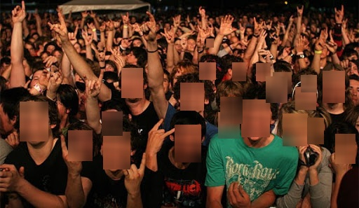
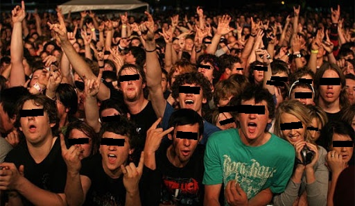

# Hide faces

Tool for hiding faces in photos and videos. It uses results obtained from [RetinaFace](https://github.com/biubug6/Pytorch_Retinaface) 
detector and has 3 modes: blur, pixelization, hiding the eyes.

## Usage

1. Clone repository: `git clone https://github.com/sz1nchenko/hide_faces.git`
2. [Download](https://drive.google.com/drive/folders/1oZRSG0ZegbVkVwUd8wUIQx8W7yfZ_ki1) weights (Resnet50_Final.pth) for detector and move it to `./weights` (default) directory
3. Run `hide.py`: `python hide.py --file [PHOTO OR VIDEO PATH] --mode [blur, pixel, eyes] --weights [WEIGHTS PATH (DEFAULT: ./weights/Resnet50_Final.pth)]`

## Results

Blur | Pixel | Eyes
----- | ----- | -----
 |  | 